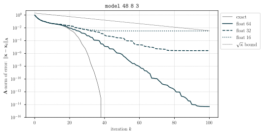
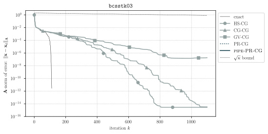

# Introduction

## Motivation
Solving a linear system of equations $Ax=b$ is one of the most important tasks in modern science.
A huge number of techniques and algorithms for dealing with more complex equations end up, in one way or another, requiring repeatedly solving linear systems.
As a result, applications such as weather forecasting, medical imaging, and training neural nets all rely on methods for efficiently solving linear systems to achieve the real world impact that we often take for granted.
When $A$ is symmetric and positive definite (if you don't remember what that means, don't worry, I have a refresher below), the conjugate gradient algorithm is a very popular choice for methods of solving $Ax=b$.

This popularity of the conjugate gradient algorithm (CG) is due to a couple factors. First, like most Krylov subspace methods, CG is *matrix free*. 
This means that $A$ never has to be explicitly represented as a matrix, as long as there is some way of computing the product $v\mapsto Av$, for a given input vector $v$.
For very large problems, this means a big reduction in storage, and if $A$ has some structure (eg. $A$ comes from a DFT, difference/integral operator, is very sparse, etc.), it allows the algorithm to take advantage of fast matrix vector products.
Second, CG only requires $\mathcal{O}(n)$ storage to run, as compared to $\mathcal{O}(n^2)$ that many other algorithms require (we use $n$ to denote the size of $A$, i.e. $A$ has shape $n\times n$). 
When the size of $A$ is very large, this becomes increasingly important.

While the conjugate gradient algorithm has many nice theoretical properties, its behavior in finite precision can be *extremely* different than the behavior predicted by assuming exact arithmetic.
Understanding what leads to these vastly different behaviors has been an active area of research since the introduction of the algorithm in the 50s.
The intent of this document is to provide an overview of the conjugate gradient algorithm in exact precision, then introduce some of what is know about it in finite precision, and finally, present some modern research interests into the algorithm.

## Measuring the accuracy of solutions
One of the first question we should ask about any numerical method is, *does it solve the intended problem?* In the case of solving linear systems, this means asking *does the output approximate the true solution?* 
If not, then there isn't much point using the method. 

Let's quickly introduce the idea of the *error* and the *residual*.
These quantities are both useful (in different ways) for measuring how close the approximate solution $\tilde{x}$ is to the true solution $x^* = A^{-1}b$.

The *error* is simply the difference between $x^*$ and $\tilde{x}$.
Taking the norm of this quantity gives us a scalar value which measures the distance between $x^*$ and $\tilde{x}$.
In some sense, this is perhaps the most natural way of measuring how close our approximate solution is to the true solution.
In fact, when we say that a sequence $x_0,x_1,x_2,\ldots$ of vectors converges to $x_*$, we mean that the sequence of scalars, $\|x^*-x_0\|,\|x^*-x_1\|,\|x^*-x_2\|,\ldots$ converges to zero.
Thus, finding $x$ which solves $Ax=b$ could be written as finding the value of $x$ which minimizes $\|x - x^*\| = \|x-A^{-1}b\|$.

Of course, since we are trying to compute $x^*$, it doesn't make sense for an algorithm to explicitly depend on $x^*$.
The *residual* of $\tilde{x}$ is defined as $b-A\tilde{x}$.
Again, $\|b-Ax^*\| = 0$, and since $x^*$ is the only point where this is true, finding $x$ to minimize $\|b-Ax\|$ gives the true solution to the linear system.
The advantage is that we can easily compute the residual $b-A\tilde{x}$ once we have our numerical solution $\tilde{x}$, while there is not necessarily a good way to compute the error $x^*-\tilde{x}$.
This means that the residual gives us a way of inspecting convergence of a method.

## Krylov subspaces

From the previous section, we know that minimizing $\|b-Ax\|$ will give the solution $x^*$.
Unfortunately, this problem is "just as hard" as solving $Ax=b$.

We would like to find a related "easier" problem.
One way to do this is to restrict the choice of values which $x$ can take. 
For instance, if we enforce that $x$ must be come from a smaller set of values, then the problem of minimizing $\|b-Ax\|$ is simpler (since there are less possibilities for $x$).
As an extreme example, if we say that $x = \alpha y$ for some fixed vector $y$, then this is a scalar minimization problem.
Of course, by restricting what values we choose for $x$ it is quite likely that we will not longer be able to exactly solve $Ax=b$.

One thing we could try to do is balance the difficulty of the problems we have to solve at each step with the accuracy of the solutions they give.
If we can obtain a very approximate solution by solving an easy problem, and then improve the solution by solving successively more difficult problems.
If we do it in the right way, it seems plausible that "increasing the difficulty" of the problem we are solving won't lead to extra work at each step, if we are be able to take advantage of having an approximate solution from a previous step.

We can formalize this idea a little bit.
Suppose we have a sequence of subspaces $V_0\subset V_1\subset V_2\subset \cdots$.
Then we can construct a sequence of iterates, $x_0\in V_0, x_1\in V_1,x_2\in V_2, \ldots$.
If, at each step, we ensure that $x_k$ minimizes $\|b-Ax\|$ over $V_k$, then the norm of the residuals will decrease (because $V_k \subset V_{k+1}$). 

Ideally this sequences of subspaces would:

1. be easy to construct 
1. be easy to optimize over (given the previous work done)
1. eventually contain the true solution

We now formally introduce Krylov subspaces, and hint at the fact that they can satisfy these properties.

The $k$-th Krylov subspace generated by a square matrix $A$ and a vector $v$ is defined to be,
$$
\mathcal{K}_k(A,v) = \operatorname{span}\{v,Av,\ldots,A^{k-1}v \}
$$

First, these subspaces are relatively easy to construct because by definition we can get a spanning set by repeatedly applying $A$ to $v$.
In fact, we can fairly easily construct an orthonormal basis for these spaces with the [Arnoldi/Lanczos](./arnoldi_lanczos.html) algorithms.

<!-- expand -->
Therefore, if we can find a quantity which can be optimized over each direction of an orthonormal basis independently, then optimizing over these expanding subspaces will be easy because we only need to optimize in a single new direction at each step.

We now show that $\mathcal{K}_k(A,b)$ will eventually contain our solution by the time $k=n$.
While this result comes about naturally from our derivation of CG, I think it is useful to relate polynomials with Krylov subspace methods early on, as the two are intimately related.

Suppose $A$ has [characteristic polynomial](https://en.wikipedia.org/wiki/Characteristic_polynomial#Characteristic_equation),
$$
p_A(t) = \det(tI-A) = c_0 + c_1t + \cdots + c_{n-1}t^{n-1} + t^n
$$
It turns out that $c_0 = (-1)^n\det(A)$ so that $c_0$ is nonzero if $A$ is invertible.

The [Cayley-Hamilton Theorem](https://en.wikipedia.org/wiki/Cayley%E2%80%93Hamilton_theorem) states that a matrix satisfies its own characteristic polynomial.
This means,
$$
0 = p_A(A) = c_0 I + c_1 A + \cdots c_{n+1} A^{n-1} + A^n
$$

Moving the identity term to the left and dividing by $-c_0$ (which won't be zero since $A$ is invertible) we can write,
$$
A^{-1} = -(c_1/c_0) I - (c_2/c_0) A - \cdots - (1/c_0) A^{n-1}
$$

This tells us that $A^{-1}$ can be written as a polynomial in $A$! (I think this is one of the coolest facts from linear algebra.) In particular,  
$$
x^* = A^{-1}b = -(c_1/c_0) b - (c_2/c_0) Ab - \cdots - (1/c_0) A^{n-1}b
$$

That is, the solution $x^*$ to the system $Ax = b$ is a linear combination of $b, Ab, A^2b, \ldots, A^{n-1}b$ (i.e. $x^*\in\mathcal{K}_n(A,b)$).
This observation is the motivation behind Krylov subspace methods.

In fact, one way of viewing many Krylov subspace methods is as building low degree polynomial approximations to $A^{-1}b$ using powers of $A$ times $b$ (in fact Krylov subspace methods can be used to approximate $f(A)b$ where $f$ is any [function](./current_research.html)).

# The Arnoldi and Lanczos algorithms

The Arnoldi and Lanczos algorithms for computing an orthonormal basis for Krylov subspaces are, in one way or another, at the core of all Krylov subspace methods.
Essentially, these algorithms are the Gram-Schmidt procedure applied to the vectors $\{v,Av,A^2v,A^3v,\ldots\}$ in clever ways.
The Arnoldi algorithm works for any matrix, and the Lanczos algorithm works for Hermitian matrices.

## The Arnoldi algorithm

Recall that given a set of vectors $\{v_1,v_2,\ldots, v_k\}$ the Gram-Schmidt procedure computes an orthonormal basis $\{q_1,q_2,\ldots,q_k\}$ so that for all $j\leq k$,
$$
\operatorname{span}\{v_1,\ldots,v_j\} = \operatorname{span}\{q_1,\ldots,q_j\}
$$

In short, at step $j$, $v_{j+1}$ is orthogonalized against each of $\{q_1,q_2,\ldots, q_j\}$.

If we tried to compute the set $\{v,Av,A^2v,\ldots\}$, it would become very close to linearly dependent (and with rounding errors essentially numerically linearly dependent).
This is because this basis is essentially the [power method](https://en.wikipedia.org/wiki/Power_iteration).
The trick behind the Arnoldi algorithm is the fact that you do not need to construct the whole set $\{v,Av,A^2v,\ldots\}$ ahead of time.
This allows us to come up with a basis for $\{v,Av,A^2v,\ldots\}$ in a more "stable" way.

Suppose at the beginning of step $k$ that we have already computed an orthonormal basis $\{q_1,q_2,\ldots,q_{k-1}\}$ which has the same span as $\{v,Av,\ldots, A^{k-2}v\}$. 
If we were doing Gram-Schmidt, then we would obtain $q_k$ by orthogonalizing $A^{k-1}v$ against each of the vectors in the basis $\{q_1,q_2, \ldots, q_{k-1}\}$.
In the Arnoldi algorithm we instead orthogonalize $Aq_{k-1}$ against $\{q_1,q_2,\ldots, q_{k-1}\}$.

Let's understand why these are the same.
First, since the span of $\{q_1,q_2,\ldots, q_{k-1}\}$ is equal to the span of $\{v,Av,\ldots, A^{k-2}v\}$, then $q_{k-1}$ can be written as a linear combination of $\{v,Av,\ldots, A^{k-2}v\}$. 
That is, there exists coefficients $c_i$ such that,
$$
q_{k-1} = c_1v + c_2Av + \cdots + c_{k-1} A^{k-2}v
$$

Therefore, multiplying by $A$ we have,
$$
Aq_{k-1} = c_1Av + c_2A^2v + \cdots c_{k-1}A^{k-1}v
$$

Now, since each of $\{Av,A^2v,\ldots, A^{k-2}v\}$ are in the span of $\{q_1,q_2,\ldots, q_{k-1}\}$, each of these components will disappear when we orthogonalize $Aq_{k-1}$ against $\{q_1,q_2,\ldots,q_{k-1}\}$. 
This gives a vector in the same direction as the vector we get by orthogonalizing $A^{k-1}v$ against $\{q_1,q_2,\ldots,q_{k-1}\}$.
Since we get $q_k$ by normalizing the resulting vector, using $Aq_{k-1}$ will give us the same value for $q_k$ as using $A^{k-1}v$.

The Arnoldi algorithm gives the relationship,
$$
AQ_k = Q_k H_k + h_{k+1,k} q_{k+1} \xi_k^{\mathsf{T}}
$$
where $Q_k = [q_1,q_2,\ldots,q_k]$ is the $n\times k$ matrix whose columns are $\{q_1,q_2,\ldots,q_k\}$, $H_k$ is a $k\times k$ [*Upper Hessenburg*](https://en.wikipedia.org/wiki/Hessenberg_matrix) matrix, and $\xi_k^{\mathsf{T}} = [0,\ldots,0,1]^{\mathsf{T}}$ is the $k$-th unit vector.

### Ritz vectors

For instance, suppose that $H_nv = \lambda v$. Then,
$$
A(Q_nv) = (Q_nH_nQ_n^{\mathsf{H}})(Q_nv) = Q_nH_nv = Q_n(\lambda v) = \lambda (Q_nv)
$$

This proves that if $v$ is an eigenvector of $H_n$ with eigenvalue $\lambda$, then $Q_nv$ is an eigenvector of $A$ with eigenvalue $\lambda$.

We have just seen that if $Q_n$ is unitary, then if $v$ is an eigenvector of $H_n$ then $Q_nv$ is an eigenvalue of $A$ when $v$. 

When $k<n$ then $Q_k$ although $Q_k$ has orthonormal columns, it is not square. Even so, we can use $Q_kv$ as an "approximate" eigenvector of $Q$.

More specifically, if $v$ is an eigenvector of $H_k$ with eigenvalue $\lambda$, then $Q_kv$ is called a *Ritz vector*, and $\lambda$ is called a *Ritz value*. 

## The Lancozs algorithm
When $A$ is Hermitian, then $Q_k^{\mathsf{H}}AQ_k = H_k$ is also Hermetian.
This means that $H_k$ is upper Hessenburg and Hermitian, so it must be tridiagonal! 
Thus, the $q_j$ satisfy a three term recurrence,
$$
Aq_j = \beta_{j-1} q_{j-1} + \alpha_j q_j + \beta_j q_{j+1}
$$
which we can write in matrix form as,
$$
AQ_k = Q_k T_k + \beta_k q_{k+1} \xi_k^{\mathsf{T}}
$$

The Lanczos algorithm is an efficient way of computing this decomposition which takes advantage of the three term recurrence.

I will present a brief derivation for the method motivated by the three term recurrence above.
Since we know that the $q_j$ satisfy the three term recurrence, we would like the method to store as few of the $q_j$ as possible (i.e. take advantage of the three term recurrence as opposed to the Arnoldi algorithm).

Suppose that we have $q_j$, $q_{j-1}$, and the coefficient $\beta_{j-1}$, and want expand the Krylov subspace to find $q_{j+1}$ in a way that takes advantage of the three term recurrence.
To do this we can expand the subspace by computing $Aq_j$ and then orthogonalizing $Aq_j$ against $q_j$ and $q_{j-1}$.
By the three term recurrence, $Aq_j$ will be orthogonal to $q_i$ for all $i\leq j-2$ so we do not need to explicitly orthogonalize against those vectors.

We orthogonalize, 
\begin{align*}
\tilde{q}_{j+1} = Aq_j - \alpha_j q_j - \langle Aq_j, q_{j-1} \rangle q_{j-1}
, && 
\alpha_{j} = \langle A q_j, q_j \rangle
\end{align*}
and finally normalize,
\begin{align*}
q_{j+1} = \tilde{q}_{j+1} / \beta_j
,&&
\beta_j = \|\tilde{q}_{j+1}\|
\end{align*}

Note that this is not the most "numerically stable" form of the algorithm, and care must be taken when implementing the Lanczos method in practice.
We can improve stability slightly by using $Aq_j - \beta_{j-1} q_{j-1}$ instead of $Aq_j$ when finding a vector in the next Krylov subspace.
This allows us to explicitly orthogonalize $q_{j+1}$ against both $q_j$ and $q_{j-1}$ rather than just $q_j$.
It also ensures that the tridiagonal matrix produces is symmetric in finite precision (since $\langle Aq_j,q_{j-1}\rangle$ may not be equal to $\beta_j$ in finite precision).

**Algorithm.** (Lanczos)
\begin{align*}
&\textbf{procedure}\text{ lanczos}( A,v ) 
\\[-.4em]&~~~~\textbf{set } q_1 = v / \|v\|, \beta_0 = 0
\\[-.4em]&~~~~\textbf{for } k=1,2,\ldots \textbf{:} 
\\[-.4em]&~~~~~~~~\textbf{set } \tilde{q}_{k+1} = Aq_k - \beta_{k-1} q_{k-1}
\\[-.4em]&~~~~~~~~\textbf{set } \alpha_k = \langle \tilde{q}_{k+1}, q_k \rangle
\\[-.4em]&~~~~~~~~\textbf{set } \tilde{q}_{k+1} = \tilde{q}_{k+1} - \alpha_k q_{k}
\\[-.4em]&~~~~~~~~\textbf{set } \beta_k = \| \tilde{q}_{k+1} \|
\\[-.4em]&~~~~~~~~\textbf{set } q_{k+1} = \tilde{q}_{k+1} / \beta_k
\\[-.4em]&~~~~~\textbf{end for}
\\[-.4em]&\textbf{end procedure}
\end{align*}

<!--
We can [implement](./lanczos.py) Lanczos iteration in numpy.
Here we assume that we only want to output the diagonals of the tridiagonal matrix $T$, and don't need any of the vectors (this would be useful if we wanted to compute the eigenvalues of $A$, but not the eigenvectors).

    def lanczos(A,q0,max_iter):
        alpha = np.zeros(max_iter)
        beta = np.zeros(max_iter)
        q_ = np.zeros(len(q0))
        q = q0/np.sqrt(q0@q0)

        for k in range(max_iter):
            qq = A@q-(beta[k-1]*q_ if k>0 else 0)
            alpha[k] = qq@q
            qq -= alpha[k]*q
            beta[k] = np.sqrt(qq@qq)
            q_ = np.copy(q)
            q = qq/beta[k]

    return alpha,beta
-->

# A Derivation of the Conjugate Gradient Algorithm

There are many ways to view/derive the conjugate gradient algorithm. 
I'll derive the algorithm by directly minimizing by minimizing the $A$-norm of the error over successive Krylov subspaces, $\mathcal{K}_k(A,b)$.
To me this is the most natural way of viewing the algorithm.
My hope is that the derivation here provides some motivation for where the algorithm comes from.
Of course, what I think is a good way to present the topic won't match up exactly with every reader's own preference, so I highly recommend looking through some other resources as well.
To me, this is of those topics where you have to go through the explanations a few times before you start to understand what is going on. 

## Minimizing the error
Now that we have that out of the way, let's begin our derivation.
As stated above, at each step we will minimize the $A$-norm of the error over successive Krylov subspaces generated by $A$ and $b$.
That is to say $x_k$ will be the point so that,
\begin{align*}
\|e_k\|_A
:=\| x_k - x^* \|_A 
= \min_{x\in\mathcal{K}_k(A,b)} \| x - x^* \|_A
,&&
x^* = A^{-1}b
\end{align*}

Since we are minimizing with respect to the $A$-norm, it will be useful to have an $A$-orthonormal basis for $\mathcal{K}_k(A,b)$.
That is, a basis which is orthonormal in the $A$-inner product.
For now, let's just suppose we have such a basis, $\{p_0,p_1,\ldots,p_{k-1}\}$, ahead of time.
Further on in the derivation we will explain a good way of coming up with this basis as we go.

Since $x_k\in\mathcal{K}_k(A,b)$ we can write $x_k$ as a linear combination of these basis vectors,
$$
x_k = a_0 p_0 + a_1 p_1 + \cdots + a_{k-1} p_{k-1}
$$

Note that we have $x_0 = 0$ and $e_k = x^* - x_k$.
Then,
$$
e_k = e_0 - a_0p_0 - a_1 p_1 - \cdots - a_{k-1} p_{k-1}
$$

By definition, the coefficients for $x_k$ were chosen to minimize the $A$-norm of the error, $\|e_k\|_A$, over $\mathcal{K}_k(A,b)$.
Therefore, $e_k$ must have zero component in each of the directions $\{ p_0,p_1,\ldots,p_{k-1} \}$, which is an $A$-orthonormal basis for $\mathcal{K}_k(A,b)$.
In particular, that means that $a_jp_j$ cancels exactly with $e_0$ in the direction of $p_j$, for all $j$. 

We now make the important observation that the coefficients depend only on $e_0$ and the $p_i$, but not on $k$. 
This means that the coefficients $a_0',a_1',\ldots,a_{k-2}'$ of $x_{k-1}$ were chosen in exactly the same way as the coefficients for $x_k$, so $a_0=a_0', a_1=a_1', \ldots, a_{k-2}=a_{k-2}'$.

We can then write,
$$
x_k = x_{k-1} + a_{k-1} p_{k-1}
$$
and
$$
e_k = e_{k-1} - a_{k-1} p_{k-1}
$$

Now that we have explicitly written $x_k$ in terms of an update to $x_{k-1}$ this is starting to look like an iterative method!

Let's compute an explicit representation of the coefficient $a_{k-1}$.
As previously noted, since we have chosen $x_k$ to minimize $\|e_k\|_A$ over $\mathcal{K}_k(A,b)$, the component of $e_k$ in each of the directions $p_0,p_1,\ldots,p_{k-1}$ must be zero.
That is, $\langle e_k , p_j \rangle = 0$ for all $i=0,1,\ldots, k-1$. Substituting our expression for $e_k$ we find,
$$
0 = \langle e_k , p_{k-1} \rangle_A
= \langle e_{k-1}, p_{k-1} \rangle - a_{k-1} \langle p_{k-1} , p_{k-1} \rangle_A
$$

Thus,
$$
a_{k-1} 
= \frac{\langle e_{k-1}, p_{k-1} \rangle_A}{\langle p_{k-1},p_{k-1} \rangle_A} 
$$

This expression might look like a bit of a roadbock, since if we knew the error $e_k = x^* - x_k$ then we would know how to obtain the solution from our guess! 
However, we have been working with the $A$-inner product so we can write,
$$
Ae_{k-1} = A(x^* - x_{k-1}) = b - Ax_{k-1} = r_{k-1}
$$
Therefore, $a_{k-1}$ can be written as,
$$
a_{k-1}
= \frac{\langle r_{k-1}, p_{k-1} \rangle}{\langle p_{k-1},A p_{k-1} \rangle} 
$$

## Finding the Search Directions
At this point we are almost done.
The last thing to do is understand how to construct the basis $\{p_0,p_1,\ldots,p_k\}$ as we go.
Since $A$ is symmetric we know there is a three term recurrence which gives an orthonormal basis. However, the basis $\{p_0,p_1,\ldots,p_k\}$ is $A$-orthogonal.
Even so, looking for a short recurrence sounds promising.

Since $r_k = b-Ax_k$ and $x_k\in\mathcal{K}_k(A,b)$, then $r_k \in \mathcal{K}_{k+1}(A,b)$.
Thus, we can obtain $p_k$ by $A$-orthogonalizing $r_k$ against $\{p_0,p_1,\ldots,p_{k-1}\}$. 

Recall that $e_k$ is $A$-orthogonal to $\mathcal{K}_k(A,b)$.
That is, for $j\leq k-1$,
$$
\langle e_k, A^j b \rangle_A = 0
$$

Therefore, noting that $Ae_k = r_k$, for $j\leq k-2$,
$$
\langle r_k, A^j b \rangle_A = 0
$$

That is, $r_k$ is $A$-orthogonal to $\mathcal{K}_{k-1}(A,b)$.
In particular, this means that, for $j\leq k-2$,
$$
\langle r_k, p_j \rangle_A = 0
$$

That means that to obtain $p_k$ we really only need to $A$-orthogonalize $r_k$ against $p_{k-1}$ instead of all the previous $p_i$! That is,
\begin{align*}
p_k = r_k + b_k p_{k-1}
,&&
b_k = - \frac{\langle r_k, p_{k-1} \rangle_A}{\langle p_{k-1}, p_{k-1} \rangle_A}
\end{align*}

The immediate consequence is that we do not need to save the entire basis $\{p_0,p_1,\ldots,p_{k-1}\}$, but instead can just keep $x_k$,$r_k$, and $p_{k-1}$.
This is perhaps somewhat unsurprising give then we have seen that when $A$ is symmetric we have a three term [Lanczos recurrence](./arnoldi_lanczos.html#the-lanczos-algorithm). 
In fact, it turns out that the relationship between CG and Lanczos is quite fundamental, and that [CG is essentially doing the Lanczos algorithm](./cg_lanczos.html).

## Putting it all together

We are now essentially done! In practice, people generally use the following equivalent (but more numerically stable) formulas for $a_{k-1}$ and $b_k$,
\begin{align*}
a_{k-1} = \frac{\langle r_{k-1},r_{k-1}\rangle}{\langle p_{k-1},Ap_{k-1}\rangle}
,&&
b_k = \frac{\langle r_k,r_k\rangle}{\langle r_{k-1},r_{k-1}\rangle}
\end{align*}

The first people to discover this algorithm Magnus Hestenes and Eduard Stiefel who independently developed it around 1952. As such, the standard implementation is attributed to them. 
Pseudocode is presented below.

**Algorithm.** (Hestenes and Stiefel conjugate gradient)
\begin{align*}
&\textbf{procedure}\text{ HSCG}( A,b,x_0 ) 
\\[-.4em]&~~~~r_0 = b-Ax_0, \nu_0 = \langle r_0,r_0 \rangle, p_0 = r_0, s_0 = Ar_0, 
\\[-.4em]&~~~~a_0 = \nu_0 / \langle p_0,s_0 \rangle
\\[-.4em]&~~~~\textbf{for } k=1,2,\ldots \textbf{:} 
\\[-.4em]&~~~~~~~~x_k = x_{k-1} + a_{k-1} p_{k-1} 
\\[-.4em]&~~~~~~~~r_k = r_{k-1} - a_{k-1} p_{k-1} 
\\[-.4em]&~~~~~~~~\nu_{k} = \langle r_k,r_k \rangle, \textbf{ and } b_k = \nu_k / \nu_{k-1}
\\[-.4em]&~~~~~~~~p_k = r_k + b_k p_{k-1}
\\[-.4em]&~~~~~~~~s_k = A p_k
\\[-.4em]&~~~~~~~~\mu_k = \langle p_k,s_k \rangle, \textbf{ and } a_k = \nu_k / \mu_k
\\[-.4em]&~~~~~\textbf{end for}
\\[-.4em]&\textbf{end procedure}
\end{align*}

<!--
\begin{align*}
&\textbf{procedure}\text{ HSCG}( A,b,x_0 ) 
\\[-.4em]&~~~~\textbf{set } r_0 = b-Ax_0, \nu_0 = \langle r_0,r_0 \rangle, p_0 = r_0, s_0 = Ar_0, 
\\[-.4em]&~~~~\phantom{\textbf{set }}a_0 = \nu_0 / \langle p_0,s_0 \rangle
\\[-.4em]&~~~~\textbf{for } k=1,2,\ldots \textbf{:} 
\\[-.4em]&~~~~~~~~\textbf{set } x_k = x_{k-1} + a_{k-1} p_{k-1} 
\\[-.4em]&~~~~~~~~\phantom{\textbf{set }} r_k = r_{k-1} - a_{k-1} p_{k-1} 
\\[-.4em]&~~~~~~~~\textbf{set } \nu_{k} = \langle r_k,r_k \rangle, \textbf{ and } b_k = \nu_k / \nu_{k-1}
\\[-.4em]&~~~~~~~~\textbf{set }p_k = r_k + b_k p_{k-1}
\\[-.4em]&~~~~~~~~\textbf{set }s_k = A p_k
\\[-.4em]&~~~~~~~~\textbf{set }\mu_k = \langle p_k,s_k \rangle, \textbf{ and } a_k = \nu_k / \mu_k
\\[-.4em]&~~~~~\textbf{end for}
\\[-.4em]&\textbf{end procedure}
\end{align*}
-->

<!--
This can be easily [implemented](./cg.py) in numpy.
Note that we use $f$ for the right hand side vector to avoid conflict with the coefficient $b$.

    def cg(A,f,max_iter):
        x = np.zeros(len(f)); r = np.copy(f); p = np.copy(r); s=A@p
        nu = r @ r; a = nu/(p@s); b = 0
        for k in range(1,max_iter):
            x += a*p
            r -= a*s

            nu_ = nu
            nu = r@r
            b = nu/nu_

            p = r + b*p
            s = A@p

            a = nu/(p@s)

        return x
-->

# Conjugate Gradient is Lanczos in Disguise

It's perhaps not so surprising that the conjugate gradient and Lanczos algorithms are closely related. After all, they are both Krylov subspace methods for symmetric matrices.

More precisely, the Lanczos algorithm will produce an orthonormal basis for $\mathcal{K}_k(A,b)$, $k=0,1,\ldots$ if we initialize with initial vector $r_0 = b$. 
In our [derivation](./cg_derivation.html) of the conjugate gradient algorithm, we saw that the updated residuals form an orthogonal basis for for these spaces.
This means the Lanczos vectors must be scaled versions of the conjugate gradient residuals.

The relationship between the conjugate gradient and Lanczos algorithms provides a way of transferring results about one algorithm to the other. 
In fact, the analysis of [finite precision CG](./finite_precision_cg.html) done by Greenbaum requires viewing CG in terms of the Lanczos recurrence.

In case you're just looking for the punchline, the Lanczos vectors and coefficients can be obtained from the conjugate gradient algorithm by the following relationship,
\begin{align*}
q_{j+1} \equiv (-1)^j\dfrac{r_j}{\|r_j\|}
,&&
\beta_j \equiv \frac{\|r_j\|}{\|r_{j-1}\|}\frac{1}{a_{j-1}}
,&&
\alpha_j \equiv \left(\frac{1}{a_{j-1}} + \frac{b_{j}}{a_{j-2}}\right)
\end{align*}

Note that the indices are offset, because the Lanczos algorithm is started with initial vector $q_1$.

## Derivation
The derivation of the above result is not particularly difficult although it is somewhat tedious.
Before you read my derivation, I would highly recommend trying to derive it on your own, since it's a good chance to improve your familiarity with both algorithms.
While I hope that my derivation is not too hard to follow, there are definitely other ways to arrive at the same result, and often to really start to understand something you have to work it out on your own.

Recall that the Lanczos algorithm gives the three term recurrence,
\begin{align*}
Aq_j = \alpha_j q_j + \beta_{j-1}q_{j-1} + \beta_j q_{j+1}
\end{align*}

In each iteration of CG we update,
\begin{align*}
r_j = r_{j-1} - a_{j-1} Ap_{j-1}
,&&
p_j = r_j + b_j p_{j-1}
\end{align*}

Thus, substituting the expression for $p_{j-1}$ we find,
\begin{align*}
r_j &= r_{j-1} - a_{j-1} A(r_{j-1} + b_{j-1} p_{j-2})
\\&= r_{j-1} - a_{j-1} Ar_{j-1} - a_{j-1}b_{j-1} A p_{j-2}
\end{align*}

Tearranging our equation for $r_{j-1}$ we have that $Ap_{j-2} = (r_{j-2} - r_{j-1}) / a_{j-2}$ so that,
\begin{align*}
    r_j &= r_{j-1} - a_{j-1} Ar_{j-1} - \frac{a_{j-1}b_{j-1}}{a_{j-2}}(r_{j-2} - r_{j-1})
\end{align*}

At this point we've found a three term recurrence for $r_j$, which is a hopeful sign that we are on the right track.
We know that the Lanczos vectors are orthonormal and that the recurrence is symmetric, so we can keep massaging our CG relation to try to get it into that form.

First, let's rearrange terms and regroup them so that the indices and matrix multiply match up with the Lanczos recurrence. This gives,
\begin{align*}
    Ar_{j-1} = \left(\frac{1}{a_{j-1}}+\frac{b_{j-1}}{a_{j-2}}\right) r_{j-1} - \frac{b_{j-1}}{a_{j-2}} r_{j-2} - \frac{1}{a_{j-1}} r_{j}
\end{align*}

Now, we normalize our residuals as $z_j = r_{j-1}/\|r_{j-1}\|$ so that $r_{j-1} = \|r_{j-1}\| z_j$. Plugging these in gives,
\begin{align*}
    \|r_{j-1}\|Az_{j} &= \|r_{j-1}\|\left(\frac{1}{a_{j-1}}+\frac{b_{j-1}}{a_{j-2}}\right) z_{j} 
    -\|r_{j-2}\|\frac{b_{j-1}}{a_{j-2}} z_{j} - \|r_j\| \frac{1}{a_{j-1}} z_{j+1}
\end{align*}

Dividing through by $\|r_{j-1}\|$ we have,
\begin{align*}
    Az_{j} &= \left(\frac{1}{a_{j-1}}+\frac{b_{j-1}}{a_{j-2}}\right) z_{j} 
    - \frac{\|r_{j-2}\|}{\|r_{j-1}\|}\frac{b_{j-1}}{a_{j-2}} z_{j-1} - \frac{\|r_j\|}{\|r_{j-1}\|} \frac{1}{a_{j-1}} z_{j+1}
\end{align*}

This looks close, but the coefficients for the last two terms should have the same formula. However, recall that $b_{j} = \langle r_j,r_j \rangle / \langle r_{j-1},r_{j-1} \rangle = \|r_j\|^2 / \|r_{j-1}\|^2$. Thus,
\begin{align*}
    Az_{j} &= \left(\frac{1}{a_{j-1}}-\frac{b_{j-1}}{a_{j-2}}\right) z_{j} 
    - \frac{\|r_{j-1}\|}{\|r_{j-2}\|}\frac{1}{a_{j-2}} z_{j-1} - \frac{\|r_j\|}{\|r_{j-1}\|} \frac{1}{a_{j-1}} z_{j+1}
\end{align*}

We're almost there! While we have the correct for the recurrence, the coefficients from the Lanczos method are always positive. This means that our $z_{j}$ have the wrong signs. Fixing this gives the relationship,
\begin{align*}
q_{j+1} \equiv (-1)^j\dfrac{r_j}{\|r_j\|}
,&&
\beta_j \equiv \frac{\|r_j\|}{\|r_{j-1}\|}\frac{1}{a_{j-1}}
,&&
\alpha_j \equiv \left(\frac{1}{a_{j-1}} + \frac{b_{j}}{a_{j-2}}\right)
\end{align*}

# Error Bounds for the Conjugate Gradient Algorithm

In our [derivation](./cg_derivation.html) of the conjugate gradient method, we minimized the $A$-norm of the error over sucessive Krylov subspaces.
Ideally we would like to know how quickly this method converge.
That is, how many iterations are needed to reach a specified level of accuracy.

## Error bounds from minimax polynomials

Previously we have show that,
$$
e_k \in e_0 + \operatorname{span}\{p_0,p_1,\ldots,p_{k-1}\} = e_0 + \mathcal{K}_k(A,b)
$$

Observing that $r_0 = Ae_0$ we find that,
$$
e_k \in e_0 +  \operatorname{span}\{Ae_0,A^2e_0,\ldots,A^{k}e_0\}
$$ 

Thus, we can write,
\begin{align*}
\| e_k \|_A =  \min_{p\in\mathcal{P}_k}\|p(A)e_0\|_A
,&&
\mathcal{P}_k = \{p : p(0) = 1, \operatorname{deg} p \leq k\}    
\end{align*}

Since $A^{1/2} p(A) = p(A)A^{1/2}$ we can write,
$$
\| p(A)e_0 \|_A
= \|A^{1/2} p(A)e_0 \|
= \|p(A) A^{1/2}e_0 \|
$$

Now, using the submultiplicative property of the 2-norm,
$$
\|p(A) A^{1/2}e_0 \|
\leq \|p(A)\| \|A^{1/2} e_0 \|
= \|p(A)\| \|e_0\|_A
$$

Since $A$ is positive definite, it is diagonalizable as $U\Lambda U^{\mathsf{H}}$ where $U$ is unitary and $\Lambda$ is the diagonal matrix of eigenvalues of $A$.
Thus, since $U^{\mathsf{H}}U = I$,
$$
A^k = (U\Lambda U^{\mathsf{H}})^k = U\Lambda^kU^{\mathsf{H}}
$$

We can then write $p(A) = Up(\Lambda)U^*$ where $p(\Lambda)$ has diagonal entries $p(\lambda_i)$.
Therefore, using the *unitary invariance* property of the 2-norm,
$$
\|p(A)\| = \|Up(\Lambda)U^{\mathsf{H}}\| = \|p(\Lambda)\|
$$

Now, since the 2-norm of a symmetric matrix is the magnitude of the largest eigenvalue,
$$
\| p(\Lambda) \| = \max_i |p(\lambda_i)|
$$

Finally, putting everything together we have,
$$
\frac{\|e_k\|_A}{\|e_0\|_A} \leq \min_{p\in\mathcal{P}_k} \max_i |p(\lambda_i)|
$$

Since the inequality we obtained from the submultiplicativity of the 2-norm is tight, this bound is also tight (in the sense that for a fixed $k$ there exists an initial error $e_0$ so that equality holds).

Polynomials of this form are called minimax polynomials. 
More formally, let $L\subset \mathbb{R}$ be some closed set.
The *minimax polynomial of degree $k$* on $L$ is the polynomial satisfying,
\begin{align*}
\min_{p\in\mathcal{P}_k} \max_{x\in L} | p(x) |
,&&
\mathcal{P}_k = \{p : p(0)=1, \deg p \leq k\}    
\end{align*}

Computing a minimax polynomial for a given set is not trivial, but an algorithm called the [Remez algorithm](./remez.html) can be used to compute it.

### Chebyshev bounds
The minimax polynomial on the eigenvalues of $A$ is a bit tricky to work with.
Although we can find it using the Remez algorithm, this is somewhat tedious, and requires knowledge of the whole spectrum of $A$.
To be useful in practice we would like a bound which depends only on information about $A$ that we might reasonably expect to have prior to solving the linear system.
One way to obtain such a bound is to expand the set on which we are looking for the minimax polynomial. 

To this end, let $\mathcal{I} =  [\lambda_{\text{min}},\lambda_{\text{max}}]$.
Then, since $\lambda_i\in\mathcal{I}$,
$$
\min_{p\in\mathcal{P}_k} \max_i |p(\lambda_i)| 
\leq \min_{p\in\mathcal{P}_k} \max_{x \in \mathcal{I}} |p(x)| 
$$

The right hand side requires that we know the largest and smallest eigenvalues of $A$, but doesn't require knowledge of any of the ones between.
This means it can be useful in practice, since we can easily compute the top and bottom eignevalues with the power method.

The minimax polynomials on a single closed interval $\mathcal{I}$ are called the *Chebyshev Polynomials*, and can be easily written down with a simple recurrence relation.

If $\mathcal{I} = [-1,1]$ then the relation is,
\begin{align*}
T_{k+1}(x) = 2xT_k(x) - T_{k-1}(x)
,&&
T_0=1
,&&
T_1=x    
\end{align*}

For $\mathcal{I} \neq [-1,1]$, the above polynomials are simply stretched and shifted to the interval in question. 

Let $\kappa = \lambda_{\text{max}} / \lambda_{\text{min}}$ (this is called the condition number).
Then, from properties of these polynomials,
$$
\frac{\|e_k\|_A}{\|e_0\|_A} \leq 2 \left( \frac{\sqrt{\kappa}-1}{\sqrt{\kappa}+1} \right)^k
$$
This bound is often referred to as the Chebyshev error bound, condition number error bound, or $\sqrt{\kappa}$ error bound.

# The Conjugate Gradient Algorithm in Finite Precision

A key component of our derivations of the [Lanczos](./arnoldi_lanczos.html) and [conjugate gradient](./cg_derivation.html) methods was the orthogonality of certain vectors.
In finite precision, we cannot have exact orthogonality, so our induction based arguments no longer hold.
It's been known since their introductions, that these algorithms behave very differently in finite precision than exact arithmetic theory would predict.
Even so, both methods are widely used in practice, which suggests that there are subtle forces at play allowing the algorithms to work.

## Finite Precision Lanczos

We have already seen that the conjugate gradient and Lanczos algorithms are [intimately related](./cg_lanczos.html).
This has allowed ideas and results derived about the Lanczos algorithm to be transfered to the conjugate gradient algorithm.

Recall that, in exact arithmetic, the Lanczos algorithm generates an orthonormal set $\{q_1,q_2,\ldots,q_k\}$ which satisfies,
$$
AQ_k = Q_k T_k + \beta_k q_{k+1} \xi_k^{\mathsf{T}}
$$
where $Q_k^{\mathsf{H}}Q_k = I_k$, and $T_k$ is symmetric tridiagonal, and $\xi_k^{\mathsf{T}} = [0,\ldots,0,1]^{\mathsf{T}}$ is the $k$-th standard unit vector.

In finite precision, orthogonality will be lost, and the algorithm can continue indefinitely.
Moreover, rounding errors may mean that the Lanczos vectors no longer exactly satisfy a three term recurrence.
We can write this relationship as,
$$
AQ_k = Q_k T_k + \beta_k q_{k+1} \xi_k^{\mathsf{T}} + F_k
$$
where $F_k$ accounts for the rounding errors.

The first significant advancement to the understanding of the Lanczos algorithm was done by Chris Paige in his 1971 PhD thesis where he showed that orthogonality of Lanczos vectors is lost once a Ritz vector has converged, and that orthogonality is lost in the direction of converged Ritz vectors [@paige_71].
The analysis relies on the assumptions that:

- the three term Lanczos recurrence is well satisfied: $\| F_k \|\approx 0$
- the Lanczos vectors have norm close to one: $\|q_j\|\approx 1$
- successive Lanczos vectors are nearly orthogonal: $\langle q_j,q_{j+1}\rangle \approx 0$

Paige also proved that (what is now) the standard Lanczos implementation satisfies the three properties above.

An analysis of similar importance to that of Paige was done by Anne Greenbaum in her 1989 paper, ["Behavior of slightly perturbed Lanczos and conjugate-gradient recurrences"](https://www.sciencedirect.com/science/article/pii/0024379589902851).
The main result of Greenbaum's work on the Lanczos algorithm is demonstrating that a perturned Lanczos recurrence of the form above can be extended to a perturbed Lanczos recurrence
\begin{align*}
    A \bar{Q}_{N+m} = \bar{Q}_{N+m} \bar{A} + \bar{F}_k
\end{align*}
where
\begin{align*}
    [\bar{Q}_{N+m}]_{:,:k} = Q_k
    ,&&
    [\bar{A}]_{:k,:k} = T_k
\end{align*}
and the eigenvalues of $\bar{A}$ are near those of $A$.

Applying the Lanczos algorithm with initial vector $\xi_1$ to any tridiagonal matrix produces that same matrix.
In particular, applying exact Lanczos to $\bar{A}$ for $k$ steps will produce the tridiagonal matrix $T$.
Thus, this highly non-trivial result allows a "backwards" type analysis for Lanczos and CG, allowing the finite precision behavior of CG and Lanczos to be related to a particular "nearby" exact arithmetic computation.

The analysis from this paper is quite involved, and while it provides sufficient conditions for good convergence, necessary conditions of similar strength are not known.
It is still an open question of whether the conditions from the analysis can be relaxed significantly or not.

### Addressing convergence in finite precision

On suggestion to dealing with the loss of orthogonality is to store and explicitly orthogonalize against all previous Lanczos vectors ["Lanczos himself"].
Of course, this comes with additional storage and computation costs.

Based on Paige's analysis, an alternative approach to complete orthogonalization is selective orthogonalization [parlett 13-8].
In this approach new Lanczos vectors are only orthogonalized against converged Ritz vectors, as Paige's work roughly shows that they are already approximately orthogonal to unconverged Ritz vectors.

## Finite precision conjugate gradient

In exact arithmetic, the conjugate gradient algorithm finds the exact solution in at most $n$ steps, and the error at step $k$ is bounded by the size of the degree $k$ minimax polynomial on the eigenvalues of $A$.
In finite precision, the loss of orthogonality leads to two easily observable effects: delayed convergence, and reduced final accuracy.
The following figure shows both of these phenomena for various precisions.

### Delay of convergence

In our [derivation](./cg_derivation.html) of the conjugate gradient algorithm, we used the $A$-orthogonality of successive search directions to show that we only needed to optimize over the current search direction. 
In finite precision, once orthogonality is lost, we not longer know that minimizing along a given search direction will also result in a solution which is optimal in the previous search directions.
As such, a conjugate gradient algorithm in finite precision will end up doing "redundant" optimization.

### Loss of attainable accuracy

In theory, CG finds the *exact* solution to the linear system $Ax=b$ in at most $n$ steps.
However, in finite precision the accuracy of iterates eventually stops decreasing.
In fact, for different variants the level at which the accuracy stops decreasing can be different.

The maximal attainable accuracy of a CG implementation in finite precision is typically analyzed in terms of the residual gap: $\Delta_{r_k} := (b - A x_k) - r_k$.

This expression was introduced by Greenbaum in [Theorem 2][@greenbaum_89] and studied in further detail in [@greenbaum_97a,sleijpen_vandervorst_fokkema_94].
Analysis of the final accuracy of a variant typically involves computing an explicit formula for the residual gap in terms of roundoff errors introduced in a finite precision algorithm.
The form of these expressions gives some indication for how large the residual gap can be expected to become.
For instance, in the case of HSCG we can observe that
\begin{align*}
    \Delta_{r_k} 
    &= (b - A (x_{k-1} + \alpha_{k-1} p_{k-1} + \delta_{x_k} )) - (r_{k-1} - \alpha_{k-1} s_{k-1} + \delta_{r_k})
    \\&= \Delta_{r_{k-1}} - A \delta_{x_k} - \delta_{r_k} + \alpha_{k-1} \delta_{s_{k-1}}
    \\& \vdots
    \\&= \Delta_{r_0} - \sum_{j=1}^{k} \left( A \delta_{x_j} + \delta_{r_j} - \alpha_{j-1} \delta_{s_{j-1}} \right)
\end{align*}
where $\delta_{x_k}$, $\delta_{r_k}$, and $\delta_{s_k}$ represent errors made while computing $x_k$, $r_k$, and $s_k$ in finite precision.

For many variants, such as HSCG, it is observed experimentally that the size of the updated residual $r_k$ decreases to much lower than the machine precision, even after the true residual has stagnated.
As a result, the size of the residual gap $\Delta_{r_k}$ can be used to estimate of the size of the smallest true residual which can be attained in finite precision, thereby giving an estimate of the accuracy of the iterate $x_k$.
Similar analyses have been done for a three-term CG variant [@gutknecht_strakos_00], and for CGCG, GVCG and other pipelined conjugate gradient variants [@cools_yetkin_agullo_giraud_vanroose_18,@carson_rozloznik_strakos_tichy_tuma_18].
However, for some variants such as GVCG, the updated residual $r_k$ may not decrease to well below machine precision, so some care must be taken when analyzing the final accuracy of such varaints.

### Updated vs. true residual

In exact precision, the updated residual $r_k$ was equal to the true residual $b-Ax_k$.
In finite precision, this is not longer the case. 
Interestingly, even in finite precision, the updated residual (of many variants) keeps decreasing far below machine precision, until it eventually underflows.

## Greenbaum's analysis

In essence, Greenbaum showed that, in finite precision, a "good" conjugate gradient algorithm applied to the matrix $A$ will behave like exact conjugate gradient applied to a larger matrix $\hat{T}$ with eigenvalues near those of $A$. 

Thus, while the [error bounds](./cg_error.html) derived based on the minimax polynomial on the spectrum of $A$ no longer hold in exact arithmetic, bounds of a similar form can be obtained by finding the minimax polynomial on the union of small intervals about the eigenvalues of $A$. In particular, the bound from Chebyshev polynomials will not be significantly affect, as the condition number of the larger matrix will be nearly identical to that of $A$.

As before, the [Remez algorithm](./remez.html) can be used to compute the minimax polynomial of a given degree on the union of intervals.

### Some conditions for the analysis
I have brushed what a "good" conjugate gradient implementation means.
In some sense this is still not known, since there has been no analysis providing both necessary and sufficient conditions for convergence to behave in a certain way.
That said, the conditions given in [@greenbaum_89] are sufficient, and should be discussed.

We have already seen that [CG is doing the Lanczos algorithm in disguise](./cg_lanczos.html). 
In particular, normalizing the residuals from CG gives the vectors $q_j$ produced by the Lanczos algorithm, and combing the CG constants in the right way gives the coefficients $\alpha_j,\beta_j$ for the three term Lanczos recurrence.
The analysis by Greenbaum requires that the perturbed Lanczos recurrence, obtained by defining $q_j$ in terms of the CG residuals, satisfy the same three properties as Paige's analysis.

As it turns out, nobody has actually ever proved that any of the Conjugate Variant methods used in practice actually satisfy these conditions. 
Any proof that a given method satisfies these properties would constitute a significant theoretical advancement in the understanding of the conjugate gradient algorithm in finite precision. 
Similarly, finding weaker conditions which provide some sort of convergence guarantees for a finite precision CG implementation would also be of significant importance.

In our paper, ["On the Convergence of Conjugate Gradient Variants in Finite Precision Arithmetic"](./../publications/greenbaum_liu_chen_19.html) we analyze some variants in terms of these quantities, and try to provide rounding error analysis which will explain why these properties are or are not satisfied for each variant.

### Finding the larger matrix
A constructive algorithm for finding an extended matrix $\hat{T}$ where exact CG behaves like finite precision CG on $A$ was presented in [@greenbaum_89]. 
The algorithm is given the Lanczos vectors and coefficients from the finite precision computation, and extends the tridiagonal matrix $T$ by slightly perturbing a new, exact, Lanczos recurrence so that it terminates. The resulting larger tridiagonal matrix $\hat{T}$, which contains $T$ in the top left block, will have eigenvalues near those of $A$ (assuming $T$ came from a "good" implementation).

An explanation of the algorithm is given in the appendix of [@greenbaum_liu_chen_19], and an jupyter notebook is available [here](https://github.com/tchen01/Conjugate_Gradient/blob/master/experiments/extend_t.ipynb), and two Python implementations of the algorithm are available in the same Github repository. 

esearch/cg/communication_hiding_variants.html---
title: Communication Hiding Conjugate Gradient Algorithms
author: '[Tyler Chen](https://chen.pw)'
keywords: ['applied','math']
description: The Conjugate Conjugate algorithm is a widely used method for solving Ax=b when A is positive definite. Mathematically equivalent variants have been developed to reduce global communication.
footer: 
More about the conjugate gradient method can be found <a href="./">here</a>.

...

So far, all we have considered are error bounds in terms of the number of iterations. 
However, in practice, what we really care about is how long a computation takes.
A natural way to try and speed up an algorithm is through parallelization, and many variants of the conjugate gradient algorithm have been introduced to try to reduce the runtime per iteration.
However, while these variants are all equivalent in exact arithmetic, they perform operations in different orders meaning they are not equivalent in finite precision arithmetic.
Based on our discussion about conjugate gradient in [finite precision](./finite_precision_cg.html), it should be too big of a surprise that the variants all behave differently.

The DOE supercomputer "Summit" is able to compute 122 petaflops per second. 
That's something like $10^{16}$ floating point operations every second!
Unfortunately, on high performance machines, conjugate gradient often perform orders of magnitude fewer floating point operations per second than the computer is theoretically capable of.

The reason for this is *communication*. 

Traditionally, analysis of algorithm runtime has been done in terms the number of operations computed, and the amount of storage used. 
However, an important factor in the real world performance is the time it takes to move data around. 
Even on a single core computer, the cost of moving a big matrix from the hard drive to memory can be significant compared to the cost of the floating point operations done.
Because of this, there is a lot of interest in reducing the communication costs of various algorithms, and conjugate gradient certainly has a lot of room for improvement.

Parallel computers work by having different processors work on different parts of a computation at the same time.
Naturally, many algorithms can be sped up this way, but the speedups are not necessarily proportional to the increase in computation power.
In many numerical algorithms, "global communication" is one of the main causes of latency.
Loosely speaking, global communication means that all processors working on a larger task must finish with their subtask and report on the result before the computation can proceed.
This means that even if we can distribute a computation to many processors, the time it takes to move the data required for those computations will eventually limit how effective adding more processors is. 
So, a 1000x increase in processing power won't necessarily cut the computation time to 1/1000th of the original time.

Ultimately, when it comes to iterative methods like CG, users usually only care about the *time to solution*; i.e. how long it will take to reach some specified accuracy.
This means that both the time per iteration and the number of iterations required to reach some accuracy should be considered.
Improving one of these quantities as the expense of the other may not actually result in a faster method.

## Communication bottlenecks in CG

Recall the standard Hestenes and Stifel CG implementation.
Much of the algorithm is scalar and vector updates which are relatively cheap (in terms of floating point operations and communication).
The most expensive computations each iteration are the matrix vector product, and the two inner products.

**Algorithm.** (Hestenes and Stiefel conjugate gradient)
\begin{align*}
&\textbf{procedure}\text{ HSCG}( A,b,x_0 ) 
\\[-.4em]&~~~~r_0 = b-Ax_0, \nu_0 = \langle r_0,r_0 \rangle, p_0 = r_0, s_0 = Ar_0, 
\\[-.4em]&~~~~a_0 = \nu_0 / \langle p_0,s_0 \rangle
\\[-.4em]&~~~~\textbf{for } k=1,2,\ldots \textbf{:} 
\\[-.4em]&~~~~~~~~x_k = x_{k-1} + a_{k-1} p_{k-1} 
\\[-.4em]&~~~~~~~~r_k = r_{k-1} - a_{k-1} s_{k-1} 
\\[-.4em]&~~~~~~~~\nu_{k} = \langle r_k,r_k \rangle, \textbf{ and } b_k = \nu_k / \nu_{k-1}
\\[-.4em]&~~~~~~~~p_k = r_k + b_k p_{k-1}
\\[-.4em]&~~~~~~~~s_k = A p_k
\\[-.4em]&~~~~~~~~\mu_k = \langle p_k,s_k \rangle, \textbf{ and } a_k = \nu_k / \mu_k
\\[-.4em]&~~~~~\textbf{end for}
\\[-.4em]&\textbf{end procedure}
\end{align*}

A matrix vector product requires $\mathcal{O}(\text{nnz})$ (number of nonzero) floating point operations, while an inner product of dense vectors requires $\mathcal{O}(n)$ operations. 
For many applications of CG, the number of nonzero entries is something like $kn$, where $k$ relatively small. 
In these cases, the cost of floating point arithmetic for a matrix vector product and an inner product is roughly the same. 

While the number of floating point operations for a sparse matrix vector product and an inner product are often similar, the communication costs for the inner products can be much higher.
In a matrix vector product, each entry of the output can be computed independently of the other entires. Moreover, each entry will generally depend on only a few entries of the matrix and a few entries of the vector.
On the other hand, an inner product requires all of the entries of both vectors. 
This means that even if parts of the computation are sent to different processors, the outputs will have be be put together in a *global reduction* (also called *global synchronization* or *all-reduce*).
This communication ends up becomining the performance bottleneck each iteration on sufficintly high performance machines.

There are multiply ways to address the communication bottleneck in CG. The two main approaches are "hiding" communication, and "avoiding" communication.
Communication hiding algorithm such as as pipelined CG introduce auxiliary vectors so that the inner products can be computed at the same time, allowing all global communcation to happen at the same time.
On the other hand, communication avoiding algorithms such as $s$-step CG compute iterations in blocks of size $s$, reducing the synchronization costs by a factor around $s$.

This piece focuses on some common communicating hiding methods.
If you're interested in communication avoiding methods, or want more information about communication hiding methods, Erin Carson has very useful [slides](https://math.nyu.edu/~erinc/ppt/Carson_PP18.pdf).

## Overlapping inner products

Suppose that we would like to be able to reduce the number of points in the algorithm a global communication is required (i.e. be able to compute all inner products simultaneously).
In the standard presentation of the conjugate gradient algorithm, we need to wait for each of the previous computations before we are able to do a matrix vector product or an inner product.
This means there are two global communications per iteration and that none of the heavy computations can be overlapped.

Using our recurrences we can write,
$$
s_k = Ap_k = A(r_k + b_k p_{k-1}) 
= Ar_k + b_k s_{k-1}
$$

If we define the axillary vector $w_k = Ar_k$, in exact arithmetic using this formula for $s_k$ will be equivalent to the original formula for $s_k$. 
However, we can now compute $w_k$ as soon as we have $r_k$.
Therefore, the computation of $\nu_k = \langle r_k,r_k \rangle$ can be overlapped with the computation of $w_k = Ar_k$.
However, this still requires two global communication points each iteration.

We now note that,
\begin{align*}
\mu_k = \langle p_k,s_k \rangle
&= \langle r_k + b_k p_{k-1}, w_k + b_k s_{k-1} \rangle
\\&= \langle r_k, w_k \rangle + b_k \langle p_{k-1}, w_k \rangle + b_k \langle r_k, s_{k-1} \rangle + b_k^2 \langle p_{k-1}, s_{k-1} \rangle
\end{align*}

Moreover, since $w_k = Ar_k$ and $s_{k-1} = Ap_{k-1}$, then $\langle p_{k-1},w_k \rangle = \langle r_{k}, s_{k-1} \rangle$. 
Thus,
$$
\mu_k = \langle r_k,w_k\rangle + 2 b_k \langle r_k,s_k \rangle + b_k^2 \mu_{k-1}
$$

Notice now that $\langle r_k,w_k \rangle$, and $\langle r_k,s_k \rangle$ can both be overlapped with $\nu_k = \langle r_k,r_k\rangle$. 
Thus, using this coefficient formula there is only a single global synchronization per iteration.
However, this came at the cost of having to compute an additional inner product. 

It turns out that we can eliminate one of the inner products.
Indeed, using our recurrence for $r_k$,
$$
\langle r_k, s_{k-1} \rangle
= \langle p_k - b_k p_{k-1}, s_{k-1} \rangle
= -b_{k} \langle p_{k-1},s_{k-1} \rangle
= -b_k\mu_{k-1}
$$

Thus, defining $\eta_k = \langle w_k,r_k \rangle$ and canceling terms,
$$
\mu_k = \langle w_k,r_k \rangle - b_k^2 \mu_{k-1}
= \eta_k - (b_k/a_k) \nu_k
$$

This variant is known as Chronopoulos and Gear conjugate gradient.

**Algorithm.** (Chronopoulos and Gear conjugate gradient)
\begin{align*}
&\textbf{procedure}\text{ CGCG}( A,b,x_0 ) 
\\[-.4em]&~~~~r_0 = b-Ax_0, \nu_0 = \langle r_0,r_0 \rangle, p_0 = r_0, s_0 = Ar_0, 
\\[-.4em]&~~~~a_0 = \nu_0 / \langle p_0,s_0 \rangle
\\[-.4em]&~~~~\textbf{for } k=1,2,\ldots \textbf{:} 
\\[-.4em]&~~~~~~~~x_k = x_{k-1} + a_{k-1} p_{k-1} 
\\[-.4em]&~~~~~~~~r_k = r_{k-1} - a_{k-1} s_{k-1} 
\\[-.4em]&~~~~~~~~w_k = Ar_k 
\\[-.4em]&~~~~~~~~\nu_{k} = \langle r_k,r_k \rangle, \textbf{ and } b_k = \nu_k / \nu_{k-1}
\\[-.4em]&~~~~~~~~\eta_k = \langle r_k, w_k \rangle, \textbf{ and } a_k = \nu_k / (\eta_k - (b_k/a_{k-1})\nu_k)
\\[-.4em]&~~~~~~~~p_k = r_k + b_k p_{k-1}
\\[-.4em]&~~~~~~~~s_k = w_k + b_k s_{k-1}
\\[-.4em]&~~~~~\textbf{end for}
\\[-.4em]&\textbf{end procedure}
\end{align*}

However, while we have only a single global communication per iteration, the matrix vector product must still be computed before we are able to compute the inner products. 
To allow the matrix vector product to be overlapped with the inner products, we again introduce auxiliary vectors.
Observe that,
\begin{align*}
w_k = Ar_k &= A(r_{k-1} - a_{k-1}s_{k-1}) 
\\&= A r_{k-1} - a_{k-1} As_{k-1}
\\&= w_{k-1} - a_{k-1} As_{k-1}
\end{align*}

Now, define $u_{k} = As_{k}$ and note that,
\begin{align*}
u_{k} = As_k &= A(w_k + b_k s_{k-1}) 
\\&= Aw_k + b_k As_{k-1} 
\\&= Aw_k + b_k u_{k-1}
\end{align*}

That's it. For convenience we define $t_k = Aw_k$. 
Then, the matrix vector product $Aw_k$ can occur as soon as we have computed $w_k$ and can be overlapped with both inner products.
This variant is known as either Ghysels and Vanroose conjugate gradient or pipelined conjugate gradient.

**Algorithm.** (Ghysels and Vanroose (pipelined) conjugate gradient)
\begin{align*}
&\textbf{procedure}\text{ GVCG}( A,b,x_0 ) 
\\[-.4em]&~~~~r_0 = b-Ax_0, \nu_0 = \langle r_0,r_0 \rangle, p_0 = r_0, s_0 = Ar_0, 
\\[-.4em]&~~~~w_0 = s_0, u_0 = Aw_0, a_0 = \nu_0 / \langle p_0,s_0 \rangle
\\[-.4em]&~~~~\textbf{for } k=1,2,\ldots \textbf{:} 
\\[-.4em]&~~~~~~~~x_k = x_{k-1} + a_{k-1} p_{k-1} 
\\[-.4em]&~~~~~~~~r_k = r_{k-1} - a_{k-1} s_{k-1} 
\\[-.4em]&~~~~~~~~w_k = w_{k-1} - a_{k-1} u_{k-1}
\\[-.4em]&~~~~~~~~\nu_k = \langle r_k,r_k\rangle, \textbf{ and } b_k = \nu_k/\nu_{k-1}
\\[-.4em]&~~~~~~~~\eta_{k} = \langle r_k,w_k \rangle, \textbf{ and } a_k = \nu_k / (\eta_k - (b_k/a_{k-1})\nu_k)
\\[-.4em]&~~~~~~~~t_k = Aw_k
\\[-.4em]&~~~~~~~~p_k = r_k + b_k p_{k-1}
\\[-.4em]&~~~~~~~~s_k = w_k + b_k s_{k-1}
\\[-.4em]&~~~~~~~~u_k = t_k + b_k u_{k-1}
\\[-.4em]&~~~~~\textbf{end for}
\\[-.4em]&\textbf{end procedure}
\end{align*}

In a derivation similar those of the "classic" communication hiding varaints on this page, Erin Carson and myself have introduced ["predict-and-recompute"](../publications/predict_and_recompute_cg.html) variants.
These variants have the same parallelism as the pipelined conjugate gradient shown here, but better numerical properties.

Recently, Cornelis, Cools, and Vanroose have developed a ["deep pipelined"](https://arxiv.org/pdf/1801.04728.pdf) conjugate gradient, which introduces even more auxiliary vectors to allow for more overlapping.

