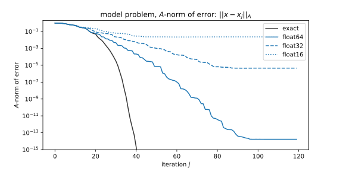

---
title: Error Bounds for the Conjugate Gradient Algorithm
author: '[Tyler Chen](https://chen.pw)'
keywords: ['applied','math']
description: The Conjugate Conjugate algorithm is a widely used method for solving Ax=b when A is positive definite. CG behaves very differently in finite precision due to rounding errors which cause a loss of orthogonality.
footer: 
More about the conjugate gradient method can be found <a href="./">here</a>.

...

A key component of our derivations of the [Lanczos](./arnoldi_lanczos.html) and [conjugate gradient](./cg_derivation.html) methods was the orthogonality of certain vectors.
In finite precision, we cannot have exact orthogonality, so our induction based arguments no longer hold.
It's been known since their introductions, that these algorithms behave very differently in finite precision than exact arithmetic theory would predict.
Even so, both methods are widely used in practice, which suggests that there are subtle forces at play allowing the algorithms to work.

## Finite Precision Lanczos

We have already seen that the conjugate gradient and Lanczos algorithms are [intimately related](./cg_lanczos.html).
This has allowed ideas and results derived about the Lanczos algorithm to be transfered to the conjugate gradient algorithm.

Recall that, in exact arithmetic, the Lanczos algorithm generates an orthonormal set $\{q_1,q_2,\ldots,q_k\}$ which satisfies,
$$
AQ_k = Q_k T_k + \beta_k q_{k+1} \xi_k^{\mathsf{T}}
$$
where $Q_k^{\mathsf{H}}Q_k = I_k$, and $T_k$ is symmetric tridiagonal, and $\xi_k^{\mathsf{T}} = [0,\ldots,0,1]^{\mathsf{T}}$ is the $k$-th standard unit vector.

In finite precision, orthogonality will be lost, and the algorithm can continue indefinitely.
We can write this relationship as,
$$
AQ_k = Q_k T_k + \beta_k q_{k+1} \xi_k^{\mathsf{T}} + F_k
$$
where $F_k$ accounts for the rounding errors.

The first significant advancement to the understanding of the Lanczos algorithm was done by Chris Paige in his 1971 PhD thesis where he showed that orthogonality of Lanczos vectors is lost once a Ritz vector has converged, and that orthogonality is lost in the direction of converged Ritz vectors [@paige_71].
The analysis relies on the assumptions that:

- the three term Lanczos recurrence is well satisfied: $\| F_k \|\approx 0$
- the Lanczos vectors have norm close to one: $\|q_j\|\approx 1$
- successive Lanczos vectors are nearly orthogonal: $\langle q_j,q_{j+1}\rangle \approx 0$

Paige also proved that (what is now) the standard Lanczos implementation satisfies the three properties above.

### Addressing convergence in finite precision

On suggestion to dealing with the loss of orthogonality is to store and explicitly orthogonalize against all previous Lanczos vectors ["Lanczos himself"].
Of course, this comes with additional storage and computation costs.

Based on Paige's analysis, an alternative approach to complete orthogonalization is selective orthogonalization [parlett 13-8].

Only orthogonalized against converged Ritz vectors.

## Finite precision conjugate gradient

In exact arithmetic, the conjugate gradient algorithm finds the exact solution in at most $n$ steps, and the error at step $k$ is bounded by the size of the degree $k$ minimax polynomial on the eigenvalues of $A$.
In finite precision, the loss of orthogonality leads to two easily observable effects: delayed convergence, and reduced final accuracy.
The following figure shows both of these phenomena for various precisions.

### Delay of convergence

In our [derivation](./cg_derivation.html) of the conjugate gradient algorithm, we used the $A$-orthogonality of successive search directions to show that we only needed to optimize over the current search direction. 
In finite precision, once orthogonality is lost, we not longer know that minimizing along a given search direction will also result in a solution which is optimal in the previous search directions.
As such, a conjugate gradient algorithm in finite precision will end up doing "redundant" optimization.

### Loss of attainable accuracy

Even if we knew the true solution $x^*$ to the system $Ax=b$, it's unlikely that we could represent it in finite precision. 
This means that any numerical method for solving linear systems will inherently have some loss of accuracy.

An algorithm is *backwards stable* if the solution it returns is the exact to a "nearby" problem. For linear systems, this means the computed solution $\tilde{x}$ satisfies,
$$
(A+\delta A) \tilde{x} = b + \delta b
$$
where $\| \delta A \| \leq \epsilon \| A \|$ and $\| \delta b \| \leq \epsilon \| b \|$.

In rounding error analysis, we generally assume that our real number $a$ can be represented in finite precision by $\tilde{a}$ satisfying, $(1-\epsilon) a \leq \tilde{a} \leq (1+\epsilon)a$, where $\epsilon$ is the machine precision.
Thus, our numerical solution $\tilde{x}$ will have error something like $\tilde{a}$

- different variants converge to worse levels

### Updated vs. true residual

In exact precision, the updated residual $r_k$ was equal to the true residual $b-Ax_k$.
In finite precision, this is not longer the case. 
Interestingly, even in finite precision, the updated residual (of many variants) keeps decreasing far below machine precision, until it eventually underflows.
**Do we know why or have citations about this?**

## Greenbaum's analysis
An analysis of similar importance to that of Paige was done by Anne Greenbaum in her 1989 paper, ["Behavior of slightly perturbed Lanczos and conjugate-gradient recurrences"](https://www.sciencedirect.com/science/article/pii/0024379589902851).
A big takeaway from Greenbaum's analysis is that the error bound from the Chevyshev polynomials still holds in finite precision (to a close approximation).

The analysis from this paper is quite involved, and while it provides sufficient conditions for good convergence, necessary conditions of similar strength are not known.
It is still an open question of whether the conditions from the analysis can be relaxed significantly or not.
In essence, Greenbaum showed that, in finite precision, a "good" conjugate gradient algorithm applied to the matrix $A$ will behave like exact conjugate gradient applied to a larger matrix $\hat{T}$ with eigenvalues near those of $A$. 

Thus, while the [error bounds](./cg_error.html) derived based on the minimax polynomial on the spectrum of $A$ no longer hold in exact arithmetic, bounds of a similar form can be obtained by finding the minimax polynomial on the union of small intervals about the eigenvalues of $A$. In particular, the bound from Chebyshev polynomials will not be significantly affect, as the condition number of the larger matrix will be nearly identical to that of $A$.

As before, the [Remez algorithm](./remez.html) can be used to compute the minimax polynomial of a given degree on the union of intervals.

### Some conditions for the analysis
I have brushed what a "good" conjugate gradient implementation means.
In some sense this is still not known, since there has been no analysis providing both necessary and sufficient conditions for convergence to behave in a certain way.
That said, the conditions given in [@greenbaum_89] are sufficient, and should be discussed.

We have already seen that [CG is doing the Lanczos algorithm in disguise](./cg_lanczos.html). 
In particular, normalizing the residuals from CG gives the vectors $q_j$ produced by the Lanczos algorithm, and combing the CG constants in the right way gives the coefficients $\alpha_j,\beta_j$ for the three term Lanczos recurrence.
The analysis by Greenbaum requires that the finite precision conjugate gradient algorithm (viewed as the Lanczos algorithm) satisfy the same three properties as Paige's analysis.

As it turns out, nobody has actually ever proved that any of the Conjugate Variant methods used in practice actually satisfy these conditions. 
Any proof that a given method satisfies these properties would constitute a significant theoretical advancement in the understanding of the conjugate gradient algorithm in finite precision. 
Similarly, finding weaker conditions which provide some sort of convergence guarantees for a finite precision CG implementation would also be of significant importance.

In our paper, ["On the Convergence of Conjugate Gradient Variants in Finite Precision Arithmetic"](./../publications/greenbaum_liu_chen_19.html) we analyze some variants in terms of these quantities, and try to provide rounding error analysis which will explain why these properties are or are not satisfied for each variant.

### Finding the larger matrix
A constructive algorithm for finding an extended matrix $\hat{T}$ where exact CG behaves like finite precision CG on $A$ was presented in [@greenbaum_89]. 
The algorithm is given the Lanczos vectors and coefficients from the finite precision computation, and extends the tridiagonal matrix $T$ by slightly perturbing a new, exact, Lanczos recurrence so that it terminates. The resulting larger tridiagonal matrix $\hat{T}$, which contains $T$ in the top left block, will have eigenvalues near those of $A$ (assuming $T$ came from a "good" implementation).

An explanation of the algorithm is given in the appendix of [@greenbaum_liu_chen_19], and an jupyter notebook is available [here](https://github.com/tchen01/Conjugate_Gradient/blob/master/experiments/extend_t.ipynb), and two Python implementations of the algorithm are available in the same Github repository. 

<!--start_pdf_comment-->
Next: [Communication hiding conjugate gradient algorithms](./communication_hiding_variants.html)
<!--end_pdf_comment-->

