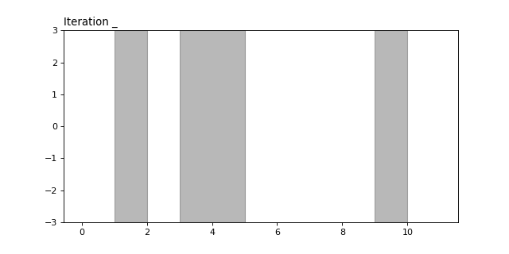

The Remez algorithm is used for calculating the degree $k$ minimax polynomial on a given set. 
Minimax polynomials can be used in the error analysis of the conjugate gradient algorithm in [exact](./cg_error.html) and [finite precion](./finite_precision_cg.html) arithmetic, but even without clear applications, I think this is a cool algorithm.

Recall that the *minimax polynomial of degree $k$* on $L$ is the polynomial satisfying,
\begin{align*}
\min_{p\in\mathcal{P}_k} \max_{x\in L} | p(x) |
,&&
\mathcal{P}_k = \{p : p(0)=1, \deg p \leq k\}
\end{align*}

The Remez algorithm works by iteratively finding better and better approximations to the minimax polynomial (of degree $k$ on some set $L$).
Before we dive into the algorithm itself, let's first take a look at an important property that minimax polynomials have. 

## Equioscillation theorem
Loosely speaking, the equioscillation theorem gives us a way of checking if a polynomial is the minimax polynomial or not.

**Theorem.** The equioscillation theorem states that $p:L\to\mathbb{R}$ is the minimax polynomial of degree $k$ if and only if there are $k+2$ points $x_0<x_1<\cdots<x_{k+1} \in L$ such that $p(x_i) = (-1)^i E$ where $E = \max_{x\in L}|p(x)|$.

Another way to say this is that $p$ is the minimax polynomial if and only if the value of $p$ at the local extrema of $p$ in $L$ are alternating in sign, and equal in magnitude to the largest value that the minimax polynomial takes on $L$.

**Intuition.**
We are minimizing the maximum size of $p$ on the set $L$.
Imagine plates above and below $L$.
The maximum size of $p$ is the furthest the plates are from $0$.
To minimize this distance, we can picture pushing the plates together.
As you squeeze them harder and harder together then you force the polynomial to move around and change it's coefficients until eventually you reach the minimum

We note also that the points $x_i$ must be local extrema of $p$ on $L$.
This is due to the fact that $|p(x_i)| = E$ means $p(x_i)$ is an extrema on $L$, and that since $p$ cannot be constant on $L$, $|p(x_i+\epsilon)|$ is either smaller than $p(x_i)$ or $x_i+\epsilon$ is not in $L$.

A very "handwavy" way to understand this theorem is that if a polynomial does not equioscillate at the local extrema, then then there is still some leeway to adjust it and make it smaller at those points.

The Remez algorithm works by iteratively refining a set of points $x_0,x_1,\ldots,x_{k+1} \in L$ (called a reference), until the reference gives exactly the $k+2$ points described in the equioscillation theorem.
At each step we force the polynomial to equioscillate, and then get the next reference by finding a set of local extrema of alternating sign for the current polynomial containing the global extrema.
Since the polynomial at each step equioscillates on the given reference, this ensures that it has $k$ real roots and that $k+1$ local extrema of alternating signs exist.

## The Algorithm

Start with $k+1$ points $\{x_0^{(0)},x_1^{(0)},\ldots,x_{k+1}^{(0)}\}$ meant to approximate the $k+1$ local extrema of the minimax polynomial on $L$.

For $j=1,2,\ldots$,

1. Find the degree $k$ polynomial $p^{(j)}$ passing through the points $(x_i^{(j-1)},(-1)^i)$. That is, the polynomial which equioscillates on these points scaled appropriately.
1. Find $k+1$ local extrema of $p^{(j)}$ on $L$ with alternating signs such that one of them is the global extrema.
Call these points $\{x_0^{(j)},x_1^{(j)}, \ldots, x_{k+1}^{(j)}\}$
1. If $x_i^{(j-1)} = x_i^{(j)}$ for all $j$, terminate.

Note that the polynomials constructed in the algorithm equioscillate between 1 and $-1$.
However, by scaling them by their value at the origin we get polynomials where $p(0)=1$.

The following animation shows the Remez algorithm computing the degree 6 minimax polynomial on the set, $L = [1,2]\cup[3,5]\cup[9,10]$.
The algorithm is initialized with a (not so great) initial reference of equally spaced points on the interval $[3,5]$.

## Implementing the Remez algorithm
Implementing the Remez algorithm can be somewhat involved since each of the steps outlined above are nontrivial. 
For instance, it requires code to find the interpolating polynomial through a set of points, and code to find local extrema of a polynomial. 
Both of these tasks require a bit of care, since they must be done in a numerically stable way.

I have implemented a general Remez algorithm which we used in the [error analysis](./finite_precision_cg.html) of CG variants.
An jupyter notebook, which generates the above animation, is available [here](https://github.com/tchen01/Conjugate_Gradient/blob/master/experiments/remez.ipynb). The interpolating polynomials were generated using [barycentric Lagrange interpolation](https://www.nada.kth.se/~olofr/Approx/BarycentricLagrange.pdf) and the extrema finding was done using a bisection like function.

