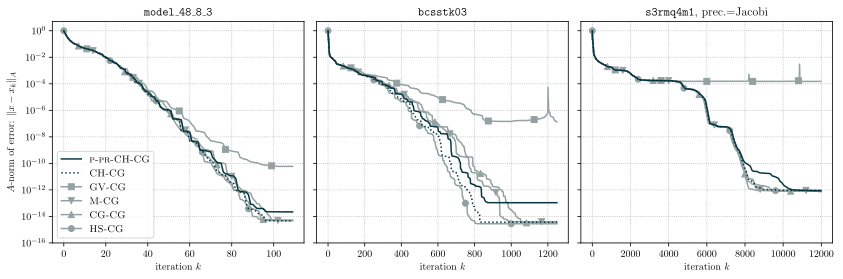
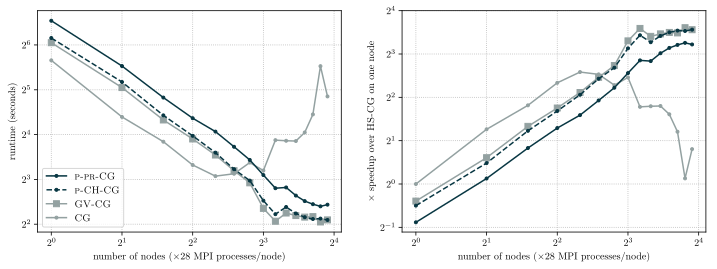

This is a companion piece to the publication:

[bibtex]

A preprint is available on arXiv: [https://arxiv.org/pdf/1905.01549.pdf](https://arxiv.org/pdf/1905.01549.pdf).

## Why should I care?

Solving linear systems is a fundamental task in numerical linear algebra because of the wide range of applications to applied fields such as the sciences, medicine, and economics. 
Recently, there has been a rapid increase in the amount of data which scientists are able to collect and store.
As a result, the linear systems which scientists now seek to solve have also been increasing in size.
Iterative methods are often the only tractable way to deal with such large systems, and Krylov subspace methods are among the most successful and widely used iterative methods.
However, the standard techniques developed years ago are no longer sufficient for many of today's applications. 
As such, new iterative methods, designed explicitly to deal with high-dimensional data, are required to handle the problems scientists now seek to solve.

The overarching motivation for this project is the fact that *the less time scientists have to wait for code to run, the more time they can spend thinking about the problems they are tackling*.

## Introduction

The conjugate gradient algorithm (CG) is very popular for solving a class of linear systems $Ax=b$ which are fairly common throughout all of science.
CG is popular for many reasons. Some important reasons are the low storage costs (linear), and the fact you don't need to be able to actually represent $A$, only to be able to evaluate the product $v\mapsto Av$.

While the low storage costs and low number of operations per iteration make CG an attractive choice for solving very large sparse (lots of zeros in $A$) systems, the standard implementation of the conjugate gradient algorithm requires that nearly every computation be done sequentially. 
In particular, it requires two inner products and one (often sparse) matrix vector product per iteration, none of which can occur simultaneously. 
Each inner product requires global communication (meaning all the processors you use have to talk to one another), and the matrix vector product (if sparse) requires local communication.
Communication (moving data between places on a computer) takes time, and on supercomputers, is the biggest thing slowing down the conjugate gradient algorithm.

It's well known that CG behaves *very* differently in finite precision than it does in exact arithmetic.
Understanding why this happens is a hard problem, and only a few results have been proved about it.
I've written an introduction to the effects of finite precision on CG [here](../cg/finite_precision_cg.html), but to summarize, the main effects are (i) the loss of ultimately attainable accuracy and (ii) the increase in number of iterations to reach a given level of accuracy (delay of convergence).

Thus, we would like to develop variants which reduce communication (and therefore the time per iteration), while simultaneously ensuring that their numerical stability is not too severely impacted (so that the number of iterations required is not increased too much).

## Contributions of this paper

The primary contributions of this paper are several new mathematically equivalent CG variants, which perform better than their previously studied counterparts.
A general framework for constructing these methods is presented.

More importantly, the idea to use predictions of quantities to allow a computation to begin, and then recomputing these quantities at a later point (an idea originally due to Meurant) is applied to the ``pipelined'' versions of these variants.

