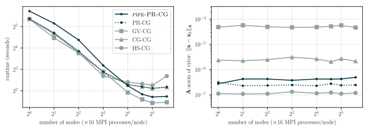

This is a companion piece to the publication:

[bibtex]

A preprint is available on [arXiv (1905.01549)](https://arxiv.org/pdf/1905.01549.pdf).

Code available to help reproduce the plots in this paper is available on [Github](https://github.com/tchen01/new_cg_variants/tree/master/predict_and_recompute).

## Why should I care?

Solving linear systems is a fundamental task in numerical linear algebra because of the wide range of applications to applied fields such as the sciences, medicine, and economics. 
Recently, there has been a rapid increase in the amount of data which scientists are able to collect and store.
As a result, the linear systems which scientists now seek to solve have also been increasing in size.
Iterative methods are often the only tractable way to deal with such large systems, and Krylov subspace methods are among the most successful and widely used iterative methods.
However, the standard techniques developed years ago are no longer sufficient for many of today's applications. 
As such, new iterative methods, designed explicitly to deal with high-dimensional data, are required to handle the problems scientists now seek to solve.

The overarching motivation for this project is the fact that *the less time scientists have to wait for code to run, the more time they can spend thinking about the problems they are tackling*.

## Introduction

The conjugate gradient algorithm (CG) is very popular for solving a class of linear systems $Ax=b$ which are fairly common throughout all of science.
CG is popular for many reasons. Some important reasons are the low storage costs (linear), and the fact you don't need to be able to actually represent $A$, only to be able to evaluate the product $v\mapsto Av$.

While the low storage costs and low number of operations per iteration make CG an attractive choice for solving very large sparse (lots of zeros in $A$) systems, the standard implementation of the conjugate gradient algorithm requires that nearly every computation be done sequentially. 
In particular, it requires two inner products and one (often sparse) matrix vector product per iteration, none of which can occur simultaneously. 
Each inner product requires global communication (meaning all the processors you use have to talk to one another), and the matrix vector product (if sparse) requires local communication.
Communication (moving data between places on a computer) takes time, and on supercomputers, is the biggest thing slowing down the conjugate gradient algorithm.
In the past others have come up with version of the CG algorithm which take less time per iteratoin by reducing communication.
I've written a bit about some of those variants [here](../cg/communication_hiding_variants.html).

However, it's well known that CG behaves *very* differently in finite precision than it does in exact arithmetic.
Understanding why this happens is a hard problem, and only a few results have been proved about it.
I've written an introduction to the effects of finite precision on CG [here](../cg/finite_precision_cg.html), but to summarize, the main effects are (i) the loss of ultimately attainable accuracy and (ii) the increase in number of iterations to reach a given level of accuracy (delay of convergence).

Unfortunately, many of the past communication hiding variants do not always work well numerically.
We would therefore like to develop variants which reduce communication (and therefore the time per iteration), while simultaneously ensuring that their numerical stability is not too severely impacted (so that the number of iterations required is not increased too much).

## Contributions of this paper

The primary contributions of this paper are several new mathematically equivalent CG variants, which perform better than their previously studied counterparts.
A general framework for constructing these methods is presented.
More importantly, the idea to use predictions of quantities to allow a computation to begin, and then recomputing these quantities at a later point (an idea originally due to Meurant) is applied to the "pipelined" versions of these variants.

The paper itself is meant to be fairly readable without a huge amount of background, so I haven't written a detailed summary here.
As a result, while I include a few of the important figures and tables below, I leave detailed explanations to the paper itself.

variant|mem.|vec.|scal.|time
:------|:---|:---|:----|:---
          HS-CG | 4 (+1) | 3 (+0) | 2 | 2 Cgr + Tmv + Cmv
          CG-CG | 5 (+1) | 4 (+0) | 2 | Cgr + Tmv + Cmv
           M-CG | 4 (+2) | 3 (+1) | 3 | Cgr + Tmv + Cmv
      **PR-CG** | 4 (+2) | 3 (+1) | 4 | Cgr + Tmv + Cmv
          GV-CG | 7 (+3) | 6 (+2) | 2 | max(Cgr, Tmv + Cmv)
**Pipe-PR-MCG** | 6 (+4) | 5 (+3) | 3 | max(Cgr, T2mv + Cmv)
 **Pipe-PR-CG** | 6 (+4) | 5 (+3) | 4 | max(Cgr, T2mv + Cmv)

:    **Table 1.** Summary of costs for various conjugate gradient variants.
Values in parenthesis are the additional costs for the preconditioned variants.
**mem**: number of vectors stored.
**vec**: number of vector updates (`AXPY`s) per iteration.
**scal**: number of inner products per iteration.
**time**: dominant costs (ignoring vector updates and inner products).
Cgr is the time spent on communication for a global reduction. 
Tmv and Cmv are the times spend on comuting a matrix vector product, and communication associated with a matrix vector product and depend on the method of matrix multiplication (for instance a dense matrix has Cmv = Cgr). 
T2mv is the cost of computing two matrix vector products simultaneously, which may be somewhat less than 2Tmv if implemented in an efficient way.
Note that in this abstraction we assume that the time of communication is independent of the size of messages sent.

Table 1 shows a summary of the costs of some different variants. Note that PR-CG, Pipe-PR-MCG, and Pipe-PR-CG are the variants introduced in this paper.
Numerical experiments on some test problems are shown in Figure 1. 

Finally, Figure 2 shows the results of a strong scaling experiment.
In particular, it should be noted that the predict and recompute varaints introduced in this paper do indeed reduce the runtime per iteration vs. HS-CG.

Despite the advances presented in this paper,  there is still significant room for  future  work  on  high  performance  conjugate  gradient  variants,  especially  in  the direction of further decreasing the communication costs.

